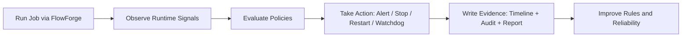

# FlowForge Company Plan (Simple Version)

Updated: 2026-02-21  
Audience: first-time readers (investors, operators, new teammates, partners)  
Read time: 5-8 minutes

## 1) What FlowForge Is

FlowForge is a local-first execution-control platform for AI and automation workloads.

In plain terms:
1. You run a job through FlowForge.
2. FlowForge watches runtime behavior (CPU, loop patterns, token burn, process health).
3. If behavior becomes risky, FlowForge applies policy (warn, stop, restart, or continue in watchdog mode).
4. FlowForge records exactly what happened and why.

Core promise: **safe intervention with clear evidence**, not black-box automation.

## 2) The Problem We Solve

Teams are running longer AI and automation jobs. When those jobs fail, loop, or burn resources, damage happens fast:
1. wasted tokens and cloud/API spend
2. machine instability and downtime
3. unclear incident causes
4. low trust in autonomous workflows

Most tools are good at monitoring after the fact. FlowForge focuses on **deterministic control during execution**.

## 3) Mission and Positioning

Mission: make FlowForge the trusted execution-control reliability layer for AI operations.

Positioning:
1. deterministic execution guardrails
2. explainable policy decisions
3. evidence and audit trail by default
4. reliability discipline as a product feature

FlowForge is **not** trying to be a generic monitoring suite or broad multi-tenant SaaS in this phase.

## 4) Product in One Visual

## 5) What We Build Now vs Later

| Build Now (P0/P1) | Build Next (After Proof) | Not in Scope (Current 12 Months) |
|---|---|---|
| Runtime guard correctness | Cost/model intelligence depth | Multi-tenant hosted SaaS |
| Decision transparency + versioning | Selective integrations | Billing-first packaging |
| Policy governance (shadow/canary/enforce) | Enterprise compliance utilities | Black-box auto-remediation |
| Unified evidence/audit events | Advanced runtime platform layers | Feature expansion without reliability proof |
| SLO + error budget operating rituals | Team-level governance workflows | Broad integrations without design-partner demand |

## 6) Customer and GTM Wedge

Primary user now: engineers/operators running long local AI or automation jobs.

Primary first-value outcome (first 60 seconds):
1. install works
2. demo shows intervention + recovery behavior
3. incident timeline explains why action happened

Go-to-market motion:
1. local CLI adoption
2. pilot users with real workloads
3. evidence-backed retention and trust metrics
4. selective team rollout
5. enterprise trust/governance expansion

## 7) 12-Week Execution Plan

### Weeks 1-2: Reliability foundation
1. lock deterministic runtime behavior
2. tune false-positive protections
3. harden onboarding/demo path

Exit signal: high demo success rate and stable CI.

### Weeks 3-4: Explainability and evidence quality
1. intervention reason/confidence quality
2. canonical event model cleanup
3. operator runbook tightness

Exit signal: operator can answer "what happened and why" quickly.

### Weeks 5-6: Pilot loop
1. run real-user pilots
2. prioritize by repeated pain
3. remove low-value complexity

Exit signal: users keep FlowForge enabled on real workloads.

### Weeks 7-8: Operational maturity
1. weekly SLO/error-budget ritual
2. release freeze/canary/soak/rollback rhythm
3. security response discipline

Exit signal: clean release cycles without emergency rollback.

### Weeks 9-12: Distribution repeatability
1. highest-signal integrations only
2. trust-focused messaging and packaging
3. publish claims backed by measured evidence

Exit signal: repeatable onboarding and pilot conversion.

## 8) 24-Month Roadmap (High Level)

1. Months 0-3: Core trust lock (runtime, policy, evidence, security, reliability rituals)
2. Months 4-6: Operator confidence (better explainability + observability)
3. Months 7-12: Disciplined expansion (selective integrations, cost intelligence entry)
4. Months 13-18: Platform consolidation (policy maturity, evidence export/compliance tooling)
5. Months 19-24: Enterprise readiness gate (scale reliability proof before wider expansion)

## 9) How We Measure Success

North-star direction: trusted execution control with measurable reliability outcomes.

Key operating metrics:
1. time-to-first-value (install to working demo)
2. detection latency (runaway to intervention)
3. false-positive rate
4. recovery success rate
5. CI/reliability gate pass rate
6. pilot 7-day retention
7. incident mean time to detect/recover
8. postmortem and corrective-action closure discipline

## 10) Business Model Direction

Packaging layers (as maturity grows):
1. core local runtime package
2. team reliability bundle
3. enterprise trust and governance bundle

Commercial principle: monetize **trust, reliability, and avoided cost**, not feature sprawl.

## 11) Operating Rules (Non-Negotiable)

1. no major expansion while reliability gates fail
2. no release without rollback readiness
3. no feature without metric + rollback plan
4. no black-box interventions
5. no roadmap growth without proof of value

## 12) Current Status Snapshot

Already in place:
1. strict CI and branch protection
2. release checkpoint discipline
3. policy canary workflow
4. unified event schema implemented
5. incident templates and runbook baseline

Near-term gaps:
1. external first-time usability validation

## 13) One-Sentence External Pitch

**FlowForge is the local-first execution-control layer for AI workloads that detects risky runtime behavior, intervenes safely, and proves every action with clear evidence.**

---

Source strategy docs for deeper detail:
- `plan.md`
- `docs/COMPANY_EXECUTION.md`
- `docs/RUNBOOK.md`
- `docs/OPERATIONS.md`
